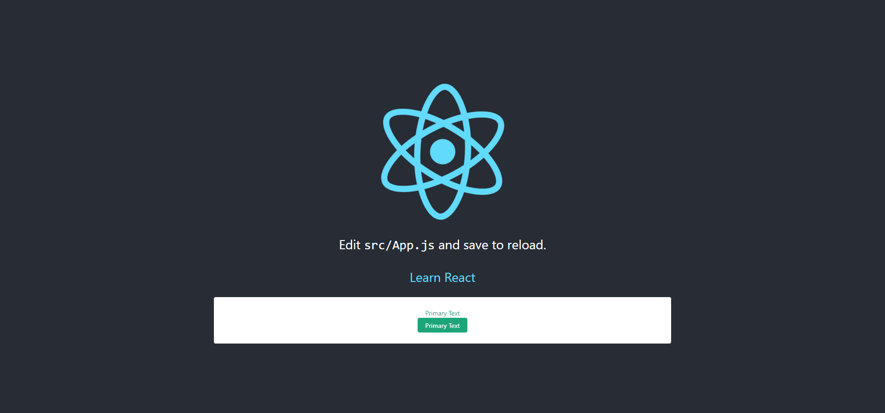

# [Create React App](https://github.com/facebook/create-react-app) 配置指南
https://github.com/goblin-laboratory/cra

## 介绍
使用 react-app-rewired 配置 Create React App 指南

## 功能特性
* 多页应用
* antd 按需加载
* less module

## 效果预览


## 使用
```
$ git clone https://github.com/goblin-laboratory/cra.git
$ cd cra
$ yarn install
$ yarn start    # 访问 http://localhost:3000
```

## 配置过程记录

### 全局安装 Create-React-App
```
$ yarn global add create-react-app@next
yarn global v1.5.1
warning ..\package.json: No license field
[1/4] Resolving packages...
[2/4] Fetching packages...
info fsevents@1.2.4: The platform "win32" is incompatible with this module.
info "fsevents@1.2.4" is an optional dependency and failed compatibility check. Excluding it from installation.
[3/4] Linking dependencies...
[4/4] Building fresh packages...
success Installed "create-react-app@2.0.0-next.3e165448" with binaries:
      - create-react-app
Done in 8.20s.
```

### 使用 `create-react-app` 命令生成项目
```
create-react-app v2 --scripts-version react-scripts@2.0.0-next.3e165448
```

### react-app-rewired
1. 添加依赖
```
yarn add react-app-rewired@next --dev
```
2. 根据 [react-app-rewired 教程](https://github.com/timarney/react-app-rewired#how-to-rewire-your-create-react-app-project)更改配置

### 其他依赖
```
yarn babel-plugin-import react-app-rewire-less-modules webpack-bundle-analyzer --dev
```
* babel-plugin-import : antd 按需加载
* react-app-rewire-less-modules : less 支持与 less module
* webpack-bundle-analyzer : build 统计工具
* eslint-config-alloy : eslint 模板


## 参考资料
* [修改create-react-app支持多入口](http://imshuai.com/create-react-app-multiple-entry-points/)
* [Add more entry points](https://github.com/facebook/create-react-app/issues/1084)
* [react-app-rewired](https://github.com/timarney/react-app-rewired)
* [在 create-react-app 中使用 antd](https://ant.design/docs/react/use-with-create-react-app-cn)
* [以react-script重构antd-pro](https://xuqiang.me/%E4%BB%A5react-script%E9%87%8D%E6%9E%84antd-pro.html)

## 遗留问题
### Failed to decode param '/%PUBLIC_URL%/favicon.ico'
```bash
URIError: Failed to decode param '/%PUBLIC_URL%/favicon.ico'
    at decodeURIComponent (<anonymous>)
    at decode_param (D:\github\cra\node_modules\express\lib\router\layer.js:172:12)
    at Layer.match (D:\github\cra\node_modules\express\lib\router\layer.js:123:27)
    at matchLayer (D:\github\cra\node_modules\express\lib\router\index.js:574:18)
    at next (D:\github\cra\node_modules\express\lib\router\index.js:220:15)
    at expressInit (D:\github\cra\node_modules\express\lib\middleware\init.js:40:5)
    at Layer.handle [as handle_request] (D:\github\cra\node_modules\express\lib\router\layer.js:95:5)
    at trim_prefix (D:\github\cra\node_modules\express\lib\router\index.js:317:13)
    at D:\github\cra\node_modules\express\lib\router\index.js:284:7
    at Function.process_params (D:\github\cra\node_modules\express\lib\router\index.js:335:12)
```

## Contributing
我们非常欢迎你的贡献，你可以通过以下方式和我们一起共建 😃：
* 通过 Issue 报告 bug 或进行咨询。
* 提交 Pull Request 。

## Licensing
cra is [MIT licensed](./LICENSE).
